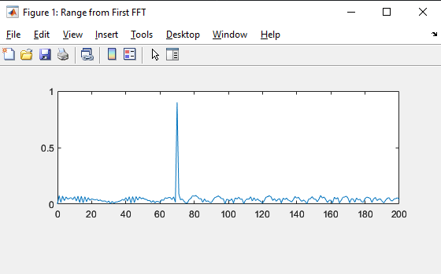
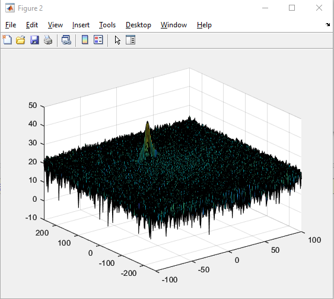
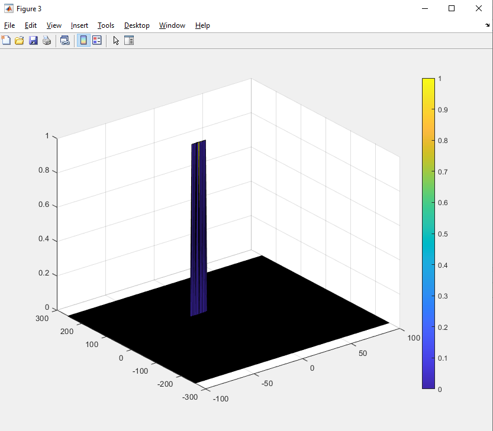

# SFND-Radar-Traget-Generation-And-Detection

## Implementations steps for the 2D CFAR Process

1) Loop over the RDM to iteratively select the CUT cell

2) for each CUT cell aggregate the value of each cells cointained in the training zone 

3) Compute the average noise for the CUT and add the threshold offset

4) Filter all the point under the previously defined threshold and set them to one if they're above the threshold
 ```
signal_cfar = zeros(Nr/2, Nd);

for i = 1+Tr+Gr : (Nr/2)-(Gr+Tr) % only one side of the FFT was selected -> Nd/2
    for j = 1+Td+Gd : Nd-(Gd+Td)
        noise_level = zeros(1,1);
        
        for p = i-(Tr+Gr) : i+(Tr+Gr)
            for q = j-(Td+Gd) : j+(Td+Gd)
                noise_level = noise_level + db2pow(RDM(p,q));   
            end
        end
        noise_level = noise_level / Tcells_size;
        % noise level calcl + offset
        threshold_cfar = pow2db(noise_level);
        threshold_cfar = threshold_cfar + offset;
        CUT = RDM(i,j);

        if (CUT > threshold_cfar)
            signal_cfar(i,j) = 1;
        end
    end
end

 ```
## Selection of Training cells, Guard cells and offset
- Training range = 12, Training doppler = 6
- Guard range = 4, Guard doppler = 2
- offset = 5

## Steps taken to supress the non Thresholded cells at the edges

This step is done by slicing desired zone and set their value to zero.
```
% Set to zero at the border of matrix using training and guard cells for range 
signal_cfar(union(1:(Tr+Gr),end-(Tr+Gr-1):end),:) = 0; 
% Set to zero at the border of matrix using training and guard cells for doppler
signal_cfar(:,union(1:(Td+Gd),end-(Td+Gd-1):end)) = 0; 
```

## Results

With an initial position of 70 m and an inital velocity of -15 m/s





